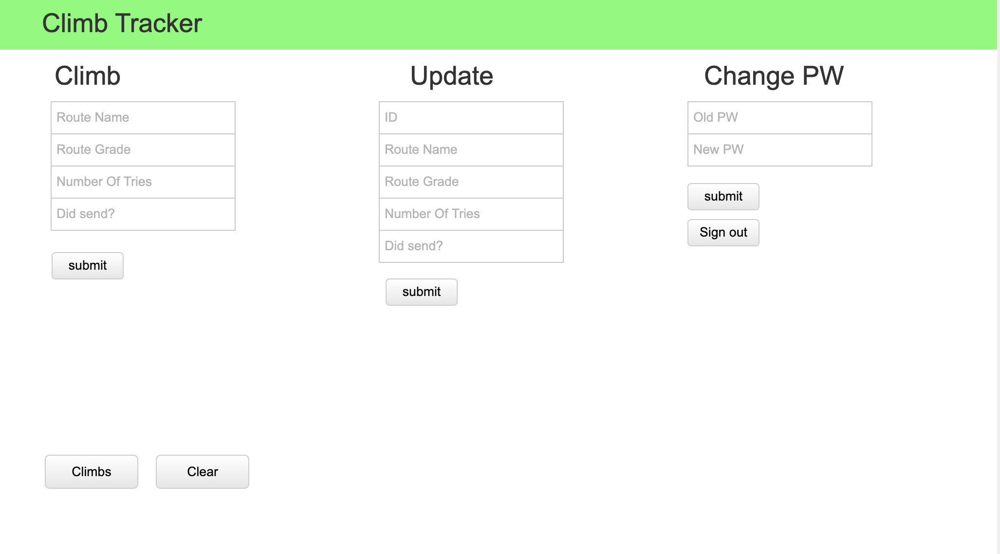

# Application Title: A Description
Climb tracker- A app to track all of your climbs. You are able to create a climb,
update a climb, and remove a climb. You also are able to view all of your climbs.

## Important Links

- [Deployed API](https://tukrong-climb-api.herokuapp.com/climbs)
- [Deployed Client](https://tukrong.github.io/tukrong_climb_tracker/)

GitHub repo-
- https://github.com/tukrong/tukrong_climb_tracker
- https://github.com/tukrong/tukrong_climb_api
## Planning Story

- Create the user authentication with back end.
- Create the html page.
- Let user be able to create a climb, update a climb, remove a climb and get all their climbs.
- User should be able to log out.
- User should be able to log back in and get all their climbs.

### User Stories

- As a user I want to create a user using email to sign up.
- As a user I want sign in using my email and password.
- As a user I want to sign in and be able to create a climb.
- As a user I want to sign in and be able to update a climb.
- As a user I want to sign in and be able to remove a climb.
- As a user I want to be able to change my password after logging in.
- As a user I want to sign out.

### Technologies Used

- jQuery
- HTML/CSS
- Bootstrap
- Javascript
- Handlebars

### Unsolved Problems

- Make the layout and design

- I would like to make the person be able to get all their climbs and then just have an update button on each climbs to update their climbs.

## Images/WireFrame

